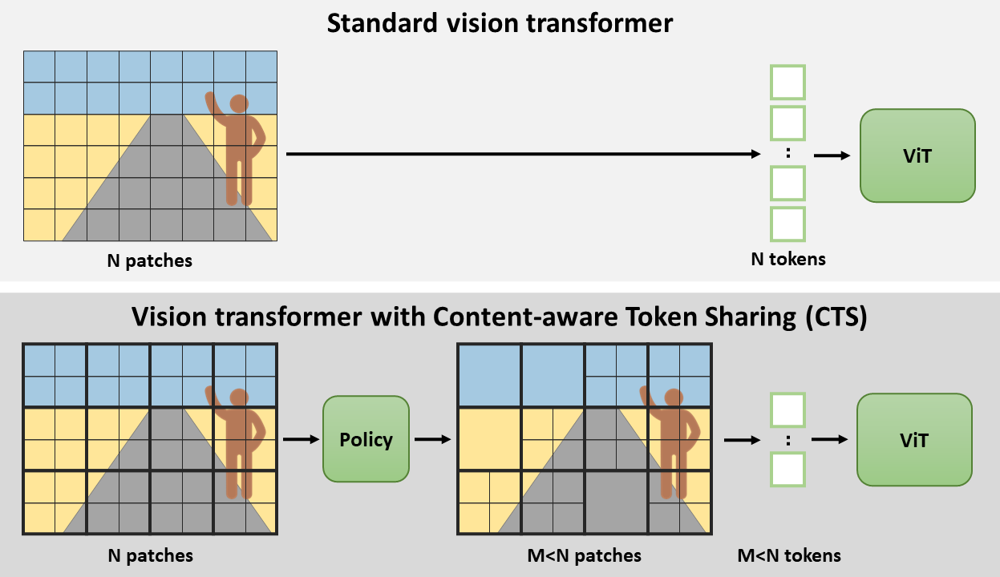

# Content-aware Token Sharing for Efficient Semantic Segmentation with Vision Transformers (CVPR 2023)


## [[Project page](https://tue-mps.github.io/CTS/)] [[Paper](https://openaccess.thecvf.com/content/CVPR2023/papers/Lu_Content-Aware_Token_Sharing_for_Efficient_Semantic_Segmentation_With_Vision_Transformers_CVPR_2023_paper.pdf)]



"[Content-aware Token Sharing for Efficient Semantic Segmentation with Vision Transformers](https://openaccess.thecvf.com/content/CVPR2023/html/Lu_Content-Aware_Token_Sharing_for_Efficient_Semantic_Segmentation_With_Vision_Transformers_CVPR_2023_paper)", by Chenyang Lu*, Daan de Geus*, and Gijs Dubbelman, CVPR 2023.

## CTS applied to Segmenter

In this repository, Content-aware Token Sharing (CTS) is applied to
[Segmenter: Transformer for Semantic Segmentation](https://arxiv.org/abs/2105.05633)
by Robin Strudel*, Ricardo Garcia*, Ivan Laptev and Cordelia Schmid, ICCV 2021.

The provided code extends the [original code for Segmenter](https://github.com/rstrudel/segmenter).

## Installation

Installation follows the installation of the original Segmenter code. Specifically: define os environment variables pointing to your checkpoint and dataset directory, put in your `.bashrc`:
```bash
export DATASET=/path/to/dataset/dir
```

Install [PyTorch](https://pytorch.org/) (1.9 to 1.13 should be compatible), then `pip install .` at the root of this repository.


To download ADE20K, use the following command:
```bash
python -m segm.scripts.prepare_ade20k $DATASET
```

Similar preparation scripts also exist for [Cityscapes](segm/scripts/prepare_cityscapes.py) and [Pascal-Context](segm/scripts/prepare_pcontext.py).

## Training
To be able to train a model with CTS, the policy network should first be trained on the segmentation dataset. [Here, we provide the code and the instructions for this policy network](policynet/README.md). The output model checkpoint file should be used below.

To train Segmenter + CTS with `ViT-S/16` and 30% token reduction (612 tokens not shared, 103 tokens shared) on ADE20K, run the command below.

```bash
python -m segm.train --log-dir runs/ade20k_segmenter_small_patch16_cts_612_103 \
                     --dataset ade20k \
                     --backbone vit_small_patch16_384 \
                     --decoder mask_transformer \
                     --policy-method policy_net \
                     --num-tokens-notshared 612 \
                     --num-tokens-shared 103 \
                     --policynet-ckpt 'policynet/logdir/policynet_efficientnet_ade20k/model.pth'
```

For more examples of training commands, see [TRAINING](./TRAINING.md).

## Inference
To evaluate on Segmenter + CTS on ADE20K, run the command below after replacing `path_to_checkpoint.pth` with the path to your checkpoint. Note: the `config.yaml` file should also be present in the folder where `path_to_checkpoint.pth`


```bash
# single-scale evaluation:
python -m segm.eval.miou path_to_checkpoint.pth ade20k --singlescale
# multi-scale evaluation:
python -m segm.eval.miou path_to_checkpoint.pth ade20k --multiscale
```


## Results and Models

Below, we provide the results for different network settings and datasets. 

In the near future, we plan to release the model weights and configuration files for the trained models.

_NOTE: We observe variances in the mIoU of up to +/- 0.5 points. In the paper and the table below, we report the median over 5 runs. Thus, it may take multiple training runs to obtain the results reported below._

### ADE20K

Segmenter models with ViT backbone:
<table>
  <tr>
    <th>Backbone</th>
    <th>CTS token reduction</th>
    <th>mIoU</th>
    <th>Crop size</th>
    <th>Im/sec (BS=32)</th>
    <th colspan="2">Download</th>
  </tr>
<tr>
    <td>ViT-Ti/16</td>
    <td>0%</td>
    <td>38.1</td>
    <td>512x512</td>
    <td>262</td>
    <td><a href="#">model (soon)</a></td>
    <td><a href="#">config (soon)</a></td>
</tr>
<tr>
    <td>ViT-Ti/16</td>
    <td>30%</td>
    <td>38.2</td>
    <td>512x512</td>
    <td>284</td>
    <td><a href="#">model (soon)</a></td>
    <td><a href="#">config (soon)</a></td>
</tr>
<tr>
    <td>ViT-S/16</td>
    <td>0%</td>
    <td>45.0</td>
    <td>512x512</td>
    <td>122</td>
    <td><a href="#">model (soon)</a></td>
    <td><a href="#">config (soon)</a></td>
</tr>
<tr>
    <td>ViT-S/16</td>
    <td>30%</td>
    <td>45.1</td>
    <td>512x512</td>
    <td>162</td>
    <td><a href="#">model (soon)</a></td>
    <td><a href="#">config (soon)</a></td>
</tr>
<tr>
    <td>ViT-B/16</td>
    <td>0%</td>
    <td>48.5</td>
    <td>512x512</td>
    <td>47</td>
    <td><a href="#">model (soon)</a></td>
    <td><a href="#">config (soon)</a></td>
</tr>
<tr>
    <td>ViT-B/16</td>
    <td>30%</td>
    <td>48.7</td>
    <td>512x512</td>
    <td>69</td>
    <td><a href="#">model (soon)</a></td>
    <td><a href="#">config (soon)</a></td>
</tr>
<tr>
    <td>ViT-L/16</td>
    <td>0%</td>
    <td>51.8</td>
    <td>640x640</td>
    <td>9.7</td>
    <td><a href="#">model (soon)</a></td>
    <td><a href="#">config (soon)</a></td>
</tr>
<tr>
    <td>ViT-L/16</td>
    <td>30%</td>
    <td>51.6</td>
    <td>640x640</td>
    <td>15</td>
    <td><a href="#">model (soon)</a></td>
    <td><a href="#">config (soon)</a></td>
</tr>
</table>


### Pascal Context
<table>
  <tr>
    <th>Backbone</th>
    <th>CTS token reduction</th>
    <th>mIoU</th>
    <th>Crop size</th>
    <th>Im/sec (BS=32)</th>
    <th colspan="2">Download</th>
  </tr>
<tr>
    <td>ViT-S/16</td>
    <td>0%</td>
    <td>53.0</td>
    <td>480x480</td>
    <td>157</td>
    <td><a href="#">model (soon)</a></td>
    <td><a href="#">config (soon)</a></td>
</tr>
<tr>
    <td>ViT-S/16</td>
    <td>30%</td>
    <td>52.9</td>
    <td>480x480</td>
    <td>203</td>
    <td><a href="#">model (soon)</a></td>
    <td><a href="#">config (soon)</a></td>
</tr>
</table>

### Cityscapes
<table>
  <tr>
    <th>Backbone</th>
    <th>CTS token reduction</th>
    <th>mIoU</th>
    <th>Crop size</th>
    <th>Im/sec (BS=32)</th>
    <th colspan="2">Download</th>
  </tr>
<tr>
    <td>ViT-S/16</td>
    <td>0%</td>
    <td>76.5</td>
    <td>768x768</td>
    <td>38</td>
    <td><a href="#">model (soon)</a></td>
    <td><a href="#">config (soon)</a></td>
</tr>
<tr>
    <td>ViT-S/16</td>
    <td>44%</td>
    <td>76.5</td>
    <td>768x768</td>
    <td>78</td>
    <td><a href="#">model (soon)</a></td>
    <td><a href="#">config (soon)</a></td>
</tr>
</table>

## BibTex

```
@inproceedings{lu2023cts,
  title={{Content-aware Token Sharing for Efficient Semantic Segmentation with Vision Transformers}},
  author={Lu, Chenyang and {de Geus}, Daan and Dubbelman, Gijs},
  booktitle={IEEE/CVF Conference on Computer Vision and Pattern Recognition (CVPR)},
  year={2023}
}
```


## Acknowledgements

This code extends the official [Segmenter](https://github.com/rstrudel/segmenter) code. The Vision Transformer code in the original repository is based on [timm](https://github.com/rwightman/pytorch-image-models) library and the semantic segmentation training and evaluation pipelines are based on [mmsegmentation](https://github.com/open-mmlab/mmsegmentation).
